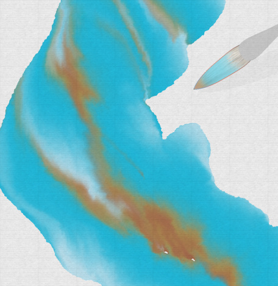

## Roadmap
StrokeGen is in the beta stage, and the current goal is to improve the stability and user experience.
 In the future, if the feedbacks were good, we plan to merge the code into official Blender.

Hopefully StrokeGen gets enough attention & success that I have the momentum and get ppl to work on it.
 If so, there are two most important features that I'll be working on: 
=== "Animation Stabilizer" 

    **Curve tracking** is required to make StrokeGen feasible for animations.
    
    StrokeGen already has a tracking framework that walks on the surface.
     <video width="500" controls>
    <source src="https://github.com/JiangWZW/strokegen-user-docs/blob/main/docs/vids/Curve%20Tracking.mp4?raw=true" type="video/mp4">
    </video> 

    Now I just have to be more specific:
    
    1.  **Reduce flickers in curve tapering** **(2-3 months)** 
    1.  **Improve curve visibility** **(1 month)** 
    1.  **Stablize arc-length parameterization** (This may take forever) 

=== "More curve types"

    Generate **Intersection** / **Crease** / **Shadow** / **Highlight** curves from the 3d surface.
     Generate **Hatching** / **Painting** strokes from the 2d image and 3d surface. 
     The goal is to implement a GPU-based algorithm for this feature and make it real-time.
    
    **Intersection** is the hardest to implement, 
     **Crease** is of medium difficulty, 
     **Shadow**/**Highlight** are the easiest. 
    
    !!! note "Have some parctical designs. Planned after the animation stabilizer."

There are also some other features that I had in mind:
=== "Advanced Brush Simulation"

    Allowing more comlicated brush behaviors, such as: 
    
    1.  **Allowing user to set a 3D brush for simulating complexed bristle behaviours**  
    1.  **GPU simulation of natural media painting, such as watercolor and ink painting.** 

     {width="215" }
    {width="500" }
    {width="500" } 

    !!! note "Should be simple. Just re-implement existing algorithms in Blender."

=== "Grease Pencil and Geometry Node"
    
    Support seamless conversion between strokegen curves and Grease Pencil strokes.
     If possible, our temporal denoiser can be used to track Grease Pencil drawings. 

    !!! note "Looking for collaborators to help with this feature" 

=== "AI related features"
    
    **Help with training a sketch-based mesh generation network.**
     StrokeGen can provide high-quality feature curves, along with the 3D mesh for the training data.
     I think this is a very natural and good idea, but I don't have the time to do it.

    **Implement a diffusion model for interactive cel shading and colorization.**
     AI colorization models often requires an edge/outline map to control the output, 
      and StrokeGen provides high quality line art to help guide this process. 
    
    !!! note "Looking for collaborators to help with this feature"

The development of StrokeGen depends on the feedback from the artist community, 
 please join the [Discord server](https://discord.gg/9Q45afM2Es) and share your thoughts and ideas!