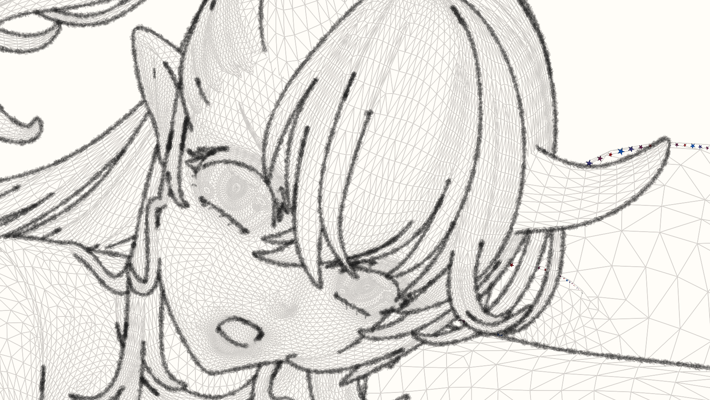
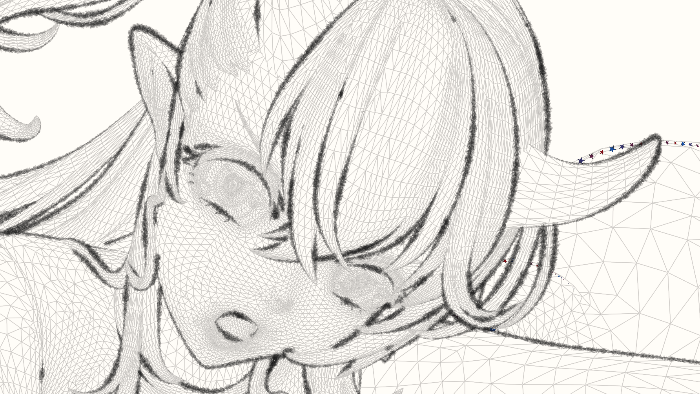
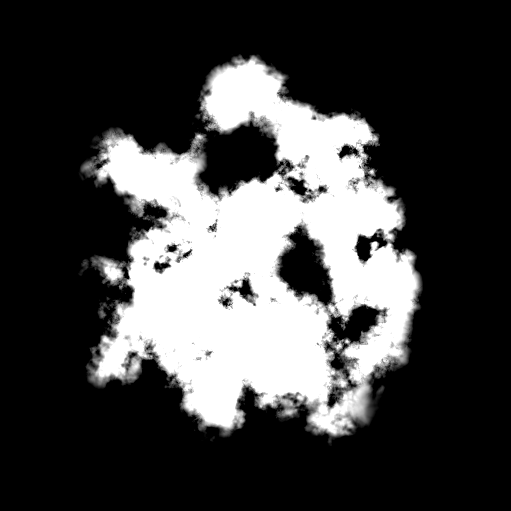

In this page, we introduce the settings in detail to help you fully utilize StrokeGen.

## Global Setting
This controls the overall behavior of StrokeGen. 

<figure markdown="span">
    {width="700" align=left}
    <figcaption>Settings to generating the 3D curves.</figcaption>
</figure>

The names are self-explanatory, but here are some details:

!!! note large "Blending Mode" 
    The blending mode for applying the curve color to the screen. 
     For advanced stylization, you should set it to **Alpha Blend**. 

!!! note large "Paper Mode"
    Set this to one to only render the curves on the screen.
      This is useful when you want to observe the curves only, without the mesh surface. 

## Per-Object Setting

=== " "
    {width="300" align=left}

    StrokeGen generates 3D curves from mesh surface, 
     then resamples them into 2D curves.

    Objects with different geometry characteristics(1) 
     may require different settings.
    { .annotate }

    1. For example, vertex density, hard/soft surfaces 

    Per-Object Setting includes two parts: 
     **Curve** and **Mesh**-related parameters. 

### Curve-related Parameters
This part of patrameters control the generation of 3D curves from the mesh surface.

=== "Curve Types"
    Currently StrokeGen supports only one type of curve: **Contour**. 
    
    Contour is a curve that follows the silhouette of the mesh. 
     In other words, it separates the front-facing and back-facing parts of the mesh. 
    
    Click image to view details and captions

    {width="315" align=left data-title="Curve network" data-description="3D contour curves extracted from the mesh surface." data-caption-position="top"}
    {width="317" align=left data-title="Visible curves" data-description="Visible portion of the 3D curves." data-caption-position="top"}
    {width="335" align=left data-title="Observe extracted contours on the surface" data-description="Contour curves change with the motion of camera and object." data-caption-position="top"}
    
    !!! note "More Curve Types"
        If StrokeGen got enough momentum  for further development (which I really doubt...), 
         **Boundary**, **Intersection**, **Crease** types will be added.

    === "Smoothed Contour"
        This option smooths the contour curves by locally optimizing the surface around the contour.
         It is useful when the contour curves are too jagged.

        !!! danger "Your mesh should have enough vertex density to support the smoothing operation."

=== "Curve Segmentation"
    Determines segmentation upon the 3D feature curves.
     Each segment will be regarded as an individual curve.
     **This will affect the final 2D curve network, hence the stylization, such as tapering, texturing, etc.** 
    
    The segmentation schemes may differ according to the curve type. 
     For contour curves, StrokeGen supports two types of segmentation: **cusp** and **corner**.

    === "Cusp"
        Cusp is where the curve self-occludes, and the tangent direction changes abruptly. 
        
        For example, the two points marked with "3" in the image below are cusps.
        <figure markdown="span">
            {width="400" align=left}
        </figure>

        Here are two images comparing results without any segmentation and with cusp enabled.

        {width="400" }
        {width="400" }

    === "2D Corner"
        Sharp corners in the 2D space. 
        
        When this is enabled, the curves will be split at those sharp corners.
        
        **Corner Angle** controls the angular threshold of the corner detection.

        Without any segmentation vs. with both cusp and corner enabled with a corner angle of 60 degrees.
        {width="400" }
        {width="400" }
        

=== "Visibility Threshold"
    This parameter controls the visibility of the 3D curves. 
     It is useful when you want to show some hidden curves that are very close to its occluder surface.

    The visibility threshold is the depth offset between the 3D curve and the mesh surface. 
     Usually a value from 0.1 - 0.3 is sufficient.

    {width="700" align=left data-title="Curve network" data-description="3D contour curves extracted from the mesh surface." data-caption-position="top"}
    

### Mesh-related Parameters
This controls the GPU processing of the mesh surface for better curve generation.

=== "Tessellation"
    StrokeGen adaptively tessellates the surface to refine the 3D curves.
      This is required when your base mesh is too coarse to generate smooth curves. 

    {width="275" align=left data-title="Adaptive Tessellation"  data-description="The tessellation is dynamic according to the movement of camera/object." data-caption-position="top"}
    
    === "Tessellation Level" 
        Higher tessellation level results in better curves but may slow down the performance.
        !!! danger "If you mesh already had a subdiv modifier with 2 or higher levels,  you should leave this value to 0."
        
        Usually, a value of **1** is sufficient for most cases. 
        
        If the curves are still not smooth enough, you can increase this value to **2**.
    
    === "Enable Crease"
        This option enables the crease detection algorithm, which helps to generate better curves on sharp edges.
         It is useful when your mesh has sharp edges that are not well supported by the vertex normals.

        !!! warning "Better to keep this off and rely on your topology.  It may generate unwanted curves on the mesh."

=== "Surface Shading Type"
    Sometimes we have to handle transparency or other special shading types.
    For now StrokeGen supports only **Opaque** and **Transparent** shading types.
    
    Usually your strokegen object should be set to **Opaque**.
     Objects with **Transparent** shading type **will not occlude any curves**. 

## Per-Material Setting

=== " "
    {width="500" align=left}
    
    This controls how the 2D curves were drawn, including the line width, color, and other visual effects.
    !!! danger large "Use an extra material solely for StrokeGen renderer and nothing else."
    
    There are two ways to render a 2D curve: **Stamp** and **Vector**.

    - **Stamp**: walk along the input trajectory and place stamps of a brush footprint. 
    - **Vector**: generate a stroke mesh from the curve spline, then fill the stroke with color/texture.

### Parameters
=== "Base Color"
    The color of the 2D curve.
    !!! danger large "Always remember to initialize the alpha to 1."
=== "Curve Width"
    The width of the 2D curve. 
=== "Textured Curve"
    This option enables the texture mapping on the 2D curve.
      Once enabled, different options will be available for stamping and vector styles.  
    === "Brush Texture & Tiling"
        The texture used for stamping brushes on the curve, or texturing the strokes.
        !!! note large "Note that the empty portion of the texture should have an alpha of 0." 
        **Brush Tiling**: The tiling of the brush texture.

        - For **Stamping** style, it is the tiling of the brush footprint.
           Usually you should set this value to 1. 
             {width="100" }
        - For **Vector** style, it is the tiling of the texture on the stroke. 
             An image of aspect ratio 4 : 1, with 4 elements, should have a tiling of 4. 
             {width="200" } 
             An image of aspect ratio 8 : 1, should have a tiling of 8.
             {width="400" } 
    
    === "Jittering for Stamped Brushes" 
        {width="200" align=left}

        If you've ever made custom brushes in Photoshop, you know what jittering is.
         It adds randomness to the brush footprint, making the curve more natural.
        
        StrokeGen supports jittering for stamped brushes.
         You can jitter the brush footprint in many ways: **Scale**, **Position**, **Rotation**, etc.         
    
    === "Paper Texture & Tiling" 
         {width="300" align=left }
        The texture to simulate the micro height variations on the paper surface. Stamped Brush only.
        
        For example, the left paper texture is a fractal noise generated in Substance Designer.
        
        **Paper Tiling**: The tiling of the paper texture.
         Usually you should set this value to 1. 
         However, you can increase it if your texture does not have enough high-frequency details.
        