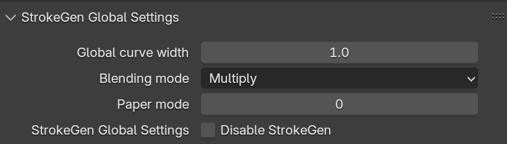
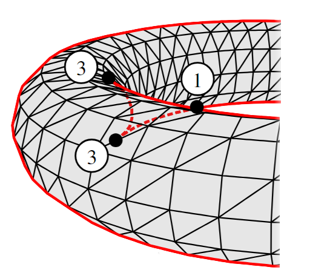

In this page, we introduce the settings in detail to help you fully utilize StrokeGen.

## Global Setting
This controls the overall behavior of StrokeGen. 

<figure markdown="span">
    {width="700" align=left}
    <figcaption>Settings to generating the 3D curves.</figcaption>
</figure>

## Per-Object Setting

=== " "
    {width="300" align=left}

    StrokeGen generates 3D curves from mesh surface, 
     then resamples them into 2D curves.

    Objects with different geometry characteristics(1) 
     may require different settings.
    { .annotate }

    1. For example, vertex density, hard/soft surfaces 

    Per-Object Setting includes two parts:
    !!! note "Curve-related Parameters" 
        This controls the generation of 3D curves from the mesh surface.
    !!! note "Mesh-related Parameters"
        This controls the GPU processing of the mesh surface for better curve generation.

### Curve-related Parameters

=== "Curve Types"
    Currently StrokeGen supports only one type of curve: **Contour**. 
    
    Contour is a curve that follows the silhouette of the mesh. 
     In other words, it separates the front-facing and back-facing parts of the mesh. 
    
    Click image to view details and captions

    {width="315" align=left data-title="Curve network" data-description="3D contour curves extracted from the mesh surface." data-caption-position="top"}
    {width="317" align=left data-title="Visible curves" data-description="Visible portion of the 3D curves." data-caption-position="top"}
    {width="335" align=left data-title="Observe extracted contours on the surface" data-description="Contour curves change with the motion of camera and object." data-caption-position="top"}
    
    !!! note "More Curve Types"
        If StrokeGen got enough momentum  for further development (which I really doubt...), 
         **Boundary**, **Intersection**, **Crease** types will be added.

    === "Smoothed Contour"
        This option smooths the contour curves by locally optimizing the surface around the contour.
         It is useful when the contour curves are too jagged.

        !!! danger "Your mesh should have enough vertex density to support the smoothing operation."

=== "Curve Segmentation"
    Determines additional segmentation upon the 3D feature curves. 
    
    The segmentation schemes may differ according to the curve type. 
     For contour curves, StrokeGen supports two types of segmentation: **cusp** and **corner**. 
    
    === "Cusp"
        Cusp is where the curve self-occludes, and the tangent direction changes abruptly. 
        
        For example, the two points marked with "3" in the image below are cusps.
        <figure markdown="span">
        {width="400" align=left}
        </figure>

    === "2D Corner"
        Sharp corners in the 2D space. 
        
        When this is enabled, the curves will be split at those sharp corners.

=== "Visibility Threshold"
    This parameter controls the visibility of the 3D curves. 
     It is useful when you want to show some hidden curves that are very close to its occluder surface.

    The visibility threshold is the depth offset between the 3D curve and the mesh surface. 
     Usually a value from 0.1 - 0.3 is sufficient.

    {width="700" align=left data-title="Curve network" data-description="3D contour curves extracted from the mesh surface." data-caption-position="top"}
    

### Mesh-related Parameters

=== "Tessellation"
    StrokeGen adaptively tessellates the surface to refine the 3D curves.
      This is required when your base mesh is too coarse to generate smooth curves. 

    === "Tessellation Level"
        Higher tessellation level results in better curves but may slow down the performance.
        !!! danger "If you mesh has already has a subdiv modifier with 2 or higher levels,  you should leave this value to 0."
        
        Usually, a value of **1** is sufficient for most cases. 
        
        If the curves are still not smooth enough, you can increase this value to **2**.
    
    === "Enable Crease"
        This option enables the crease detection algorithm, which helps to generate better curves on sharp edges.
         It is useful when your mesh has sharp edges that are not well supported by the vertex normals.

        !!! warning "Better to keep this off and rely on your topology.  It may generate unwanted curves on the mesh."

=== "Surface Shading Type"

## Per-Material Setting
This controls how the 2D curves were drawn, including the line width, color, and other visual effects.
  Note that except the main material used for shading, 
  you need an extra material for solely rendering the curves.

