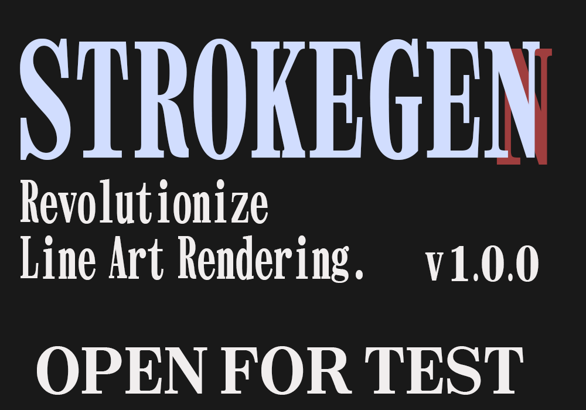
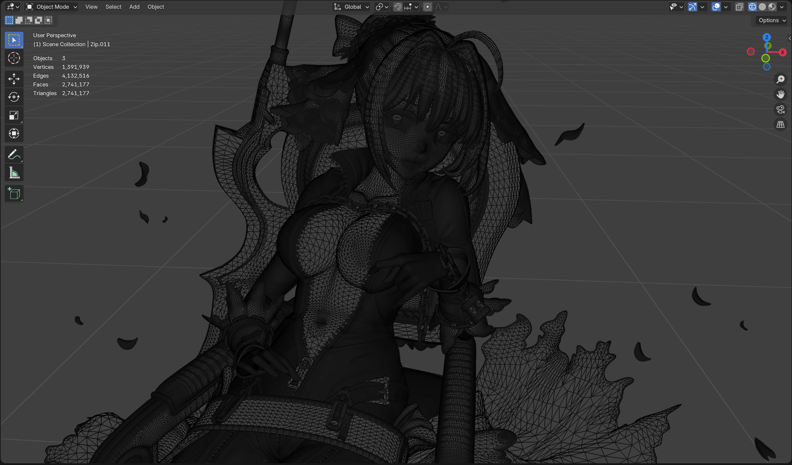

{ align=left style="height:370px;width:535px" }
 StrokeGen is a customized Blender build(1) developed by Wangziwei Jiang(2). 
{ .annotate } 

1. Why not a plugin? Because the algorithm requires deep integration inside Blender, which is not possible with a python plugin. 
2. Who is Wangziwei Jiang? {: .off-glb .image-left } A graphics programmer and 3D artist who is passionate about NPR and has been working on this project for years.

-   :octicons-download-16: __Downlads__

    :octicons-arrow-right-24: [Beta Releases](https://github.com/JiangWZW/strokegen-releases/releases)
     :octicons-arrow-right-24: Stable Releases

-   :material-book-open-outline: __Tutorials__

    :octicons-arrow-right-24: [Quick Start](./Quick%20Start.md)
     :octicons-arrow-right-24: [Best Practice](./Best%20Practices.md)
     :octicons-arrow-right-24: [Documentation](./Documentation.md)

##Features

-   :material-brush: __Elegant curve topology__
    
    ---
    Generate curves with a visually pleasant topology, essential for creating high-quality line art.

-   :simple-rocket: __Real-time response__

    ---
    StrokeGen is designed to provide real-time feedback, allowing you to focus on your art.

<link
  rel="stylesheet"
  href="https://cdn.jsdelivr.net/npm/img-comparison-slider@8/dist/styles.css"
/>

{: .off-glb slot="first" }
{: .off-glb slot="second" }
</img-comparison-slider>
(Models from [ucupumar](https://www.patreon.com/c/ucupumar/posts))

-   :material-account-group:{ .lg .middle } __Driven by Community__

    ---
    Strokegen is still in development, and your feedback is essential to its success.
    
    :octicons-arrow-right-24: Join the [Discord](https://discord.gg/9Q45afM2Es) community to share your thoughts and ideas.

-   :material-scale-balance:{ .lg .middle } __Open Source__

    ---
    Strokegen is open-source software, and you can find the source code on [GitHub](https://projects.blender.org/WangZiWei-Jiang/fork-npr-strokegen.git)
    
    In the future, if the feedbacks were good, we plan to merge the code into official Blender.

