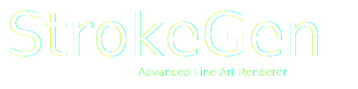

{ align=left }
The goal of StrokeGen is to empower 3D artists with a powerful tool for creating high-quality line art. 
 It is developed as a customized Blender build by Wangziwei Jiang.

-   :octicons-download-16: __Downlads__

    [Beta Releases](https://github.com/JiangWZW/strokegen-releases/releases)
     Stable Releases

-   :material-book-open-outline: __Tutorials__

    [Quick Start](./Quick%20Start.md)

-   :material-brush: __Elegant curve topology__
    
    ---
    Generate curves with a visually pleasant topology, essential for creating high-quality line art.

-   :simple-rocket: __Real-time response__

    ---
    StrokeGen is designed to provide real-time feedback, allowing you to focus on your art.

<link
  rel="stylesheet"
  href="https://cdn.jsdelivr.net/npm/img-comparison-slider@8/dist/styles.css"
/>

{: .off-glb slot="first" }
{: .off-glb slot="second" }
</img-comparison-slider>

-   :material-format-font:{ .lg .middle } __Made to measure__

    ---
    

-   :material-scale-balance:{ .lg .middle } __Open Source__

    ---

## Roadmap

